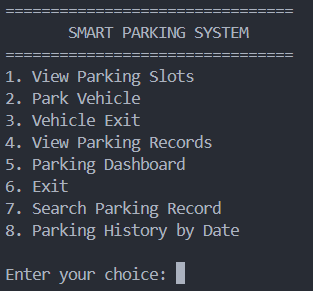
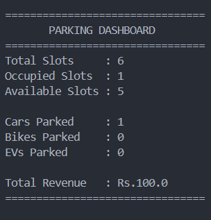
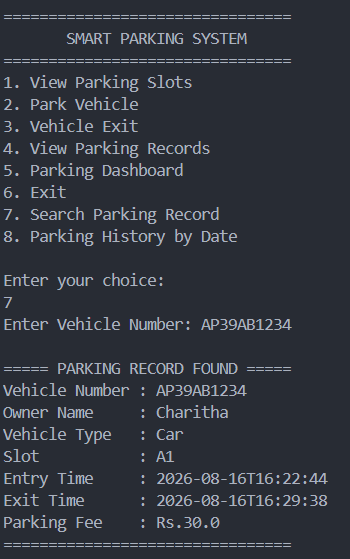
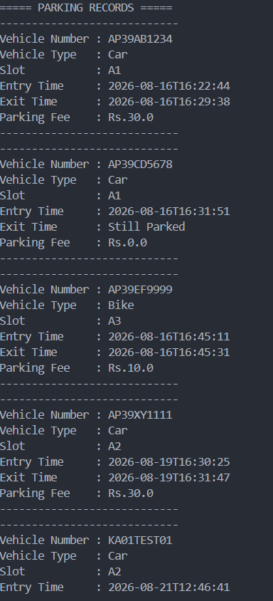
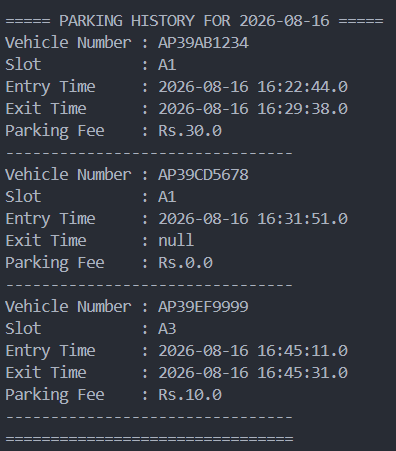

# 🚗 Smart Parking Management System

A **Java and MySQL-based Smart Parking Management System** designed to manage parking slots, vehicle entry and exit, parking records, parking fees, and parking analytics.

The system uses **JDBC** to connect the Java application with a MySQL database and provides an admin-based console interface for managing parking operations.

## ✨ Features

- 🔐 Admin login authentication
- 🅿️ View available and occupied parking slots
- 🚗 Park vehicles based on vehicle type
- 🏍️ Supports Car, Bike, and EV
- 📍 Automatically assigns an available parking slot
- 🚫 Prevents duplicate parking of the same vehicle
- 🕐 Records vehicle entry time
- 🚪 Records vehicle exit time
- 💰 Automatically calculates parking fees
- 🗄️ Stores parking information in MySQL
- 🔄 Loads parking slots and records from MySQL when the application starts
- 📋 View complete parking records
- 📊 Parking dashboard with:
  - Total parking slots
  - Occupied slots
  - Available slots
  - Cars currently parked
  - Bikes currently parked
  - EVs currently parked
  - Total parking revenue
- 🔎 Search parking records using vehicle number
- 📅 Search parking history by date

## 🛠️ Technologies Used

- **Java**
- **MySQL**
- **JDBC**
- **MySQL Connector/J**
- **Git**
- **GitHub**

## 📁 Project Structure

```text
SmartParkingSystem/
│
├── Main.java
├── AdminLogin.java
├── DBConnection.java
├── ParkingManager.java
├── ParkingSlot.java
├── ParkingRecord.java
├── ParkingFeeCalculator.java
├── Vehicle.java
│
├── database/
│   └── smart_parking.sql
│
├── lib/
│   └── mysql-connector-j-26.7.0.jar
│
├── .gitignore
└── README.md
## 📸 Screenshots

### 🅿️ Main Menu



### 📊 Parking Dashboard



### 🔎 Search Parking Record



### 📋 Parking Records



### 📅 Parking History by Date



## 👨‍💻 Author

**Polavarapu Prem Charitha**

B.Tech – Artificial Intelligence & Machine Learning